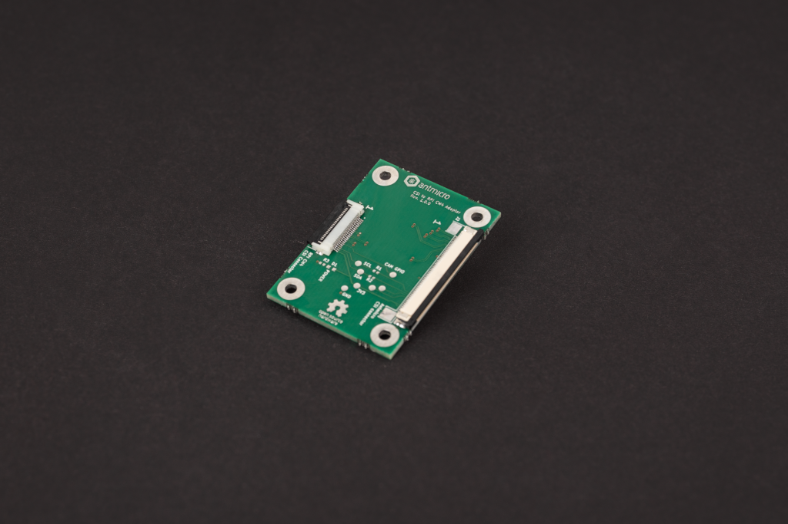

# Antmicro's Raspberry Pi CM4 CSI adapter

Copyright (c) 2022 [Antmicro](https://www.antmicro.com)

## Overview

This repository contains open hardware design files for an adapter board allowing to connect video accessories developed by Antmicro to a Raspberry Pi CM4 IO Board over a 22-pin FFC connector.
The adapter allows to connect a 4-lane MIPI CSI-2 video interface along with power supply rail and I2C bus.  
The design files were prepared in KiCad.

## Repository structure

The main repository directory contains KiCad PCB project files, a LICENSE and README.
The remaining files are stored in the following directories:

* `lib` - contains the component libraries
* `img` - contains graphics for this README

## Key Features

* 50-pin FFC connector compatible with video accessories developed by Antmicro
* 22-pin FFC connector compatible with CSI video interface exposed on Raspberry Pi CM4 IO board
* Testpoints and jumper resistors for debugging the I2C communication

This adapter is electrically compatible with several video accessories created by Antmicro such as:
 
* [OV9281 Dual Camera Board](https://github.com/antmicro/ov9281-camera-board)
* [SDI-MIPI bridge](https://github.com/antmicro/sdi-mipi-bridge)
* [HDMI-MIPI bridge](https://github.com/antmicro/hdmi-mipi-bridge)

## License

[Apache-2.0](LICENSE)
